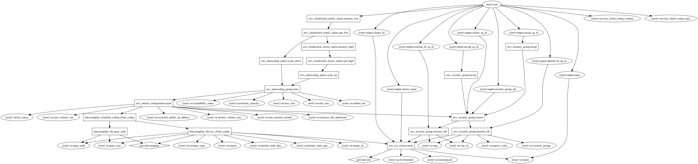

ECS Cluster creates a cluster with the following features:

 - Autoscaling groups
 - Instance tags for filtering
 - EBS volume for docker resources

Usage:

     module "cdn" {
       source               = "github.com/segmentio/stack/ecs-cluster"
       environment          = "prod"
       name                 = "cdn"
       vpc_id               = "vpc-id"
       image_id             = "ami-id"
       subnet_ids           = ["1" ,"2"]
       key_name             = "ssh-key"
       security_groups      = "1,2"
       iam_instance_profile = "id"
       region               = "us-west-2"
       availability_zones   = ["a", "b"]
       instance_type        = "t2.small"
     }

## Inputs

| Name | Description | Default | Required |
|------|-------------|:-----:|:-----:|
| associate_public_ip_address | Should created instances be publicly accessible (if the SG allows) | `false` | no |
| availability_zones | List of AZs | - | yes |
| desired_capacity | Desired instance count | `3` | no |
| docker_auth_data | A JSON object providing the docker auth data, see https://godoc.org/github.com/aws/amazon-ecs-agent/agent/engine/dockerauth for the supported formats | `` | no |
| docker_auth_type | The docker auth type, see https://godoc.org/github.com/aws/amazon-ecs-agent/agent/engine/dockerauth for the possible values | `` | no |
| docker_volume_size | Attached EBS volume size in GB | `22` | no |
| environment | Environment (ex: dev, qa, stage, prod) | - | yes |
| extra_cloud_config_content | Extra cloud config content | `` | no |
| extra_cloud_config_type | Extra cloud config type | `text/cloud-config` | no |
| iam_instance_profile | Instance profile ARN to use in the launch configuration | - | yes |
| image_id | AMI Image ID | - | yes |
| ingress_cidrs | Comma separated list of CIDRs for ingress | - | yes |
| instance_ebs_optimized | When set to true the instance will be launched with EBS optimized turned on | `true` | no |
| instance_type | The instance type to use, e.g t2.small | - | yes |
| key_name | SSH key name to use | - | yes |
| max_size | Maxmimum instance count | `100` | no |
| min_size | Minimum instance count | `3` | no |
| name | Name | - | yes |
| namespaced | Namespace all resources (prefixed with the environment)? | `true` | no |
| quay_auth | Quay Docker Account Authorization | - | yes |
| quay_user | Quay Docker Account User | - | yes |
| region | AWS Region | `us-east-1` | no |
| root_volume_size | Root volume size in GB | `8` | no |
| security_groups | Comma separated list of security groups | - | yes |
| subnet_ids | List of subnet IDs | - | yes |
| tags | A map of tags to add to all resources | `<map>` | no |
| vpc_id | VPC ID | - | yes |

## Outputs

| Name | Description |
|------|-------------|
| cluster_id | ECS Cluster ID |
| cluster_name | ECS Cluster Name |
| cluster_sg_id | Cluster security group ID. |
| external_lb_sg_id | External LB security group ID. |
| internal_lb_sg_id | Internal LB security group ID. |
| mssql_sg_id | RDS MS SQL Server security group ID |
| mysql_sg_id | RDS MySQL security group ID |
| name | The cluster name, e.g cdn |
| security_group_ids | All Security Groups IDs |

### Resource Graph

